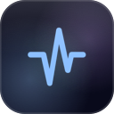
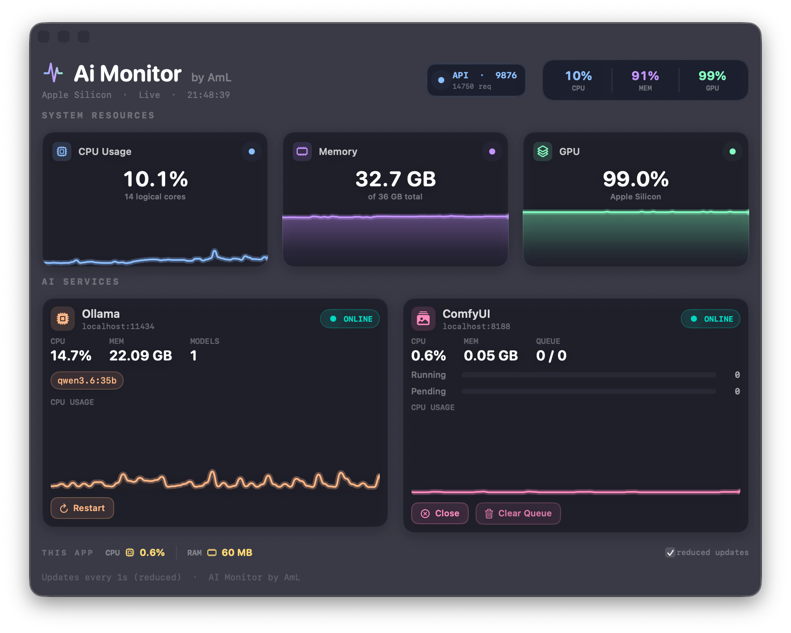
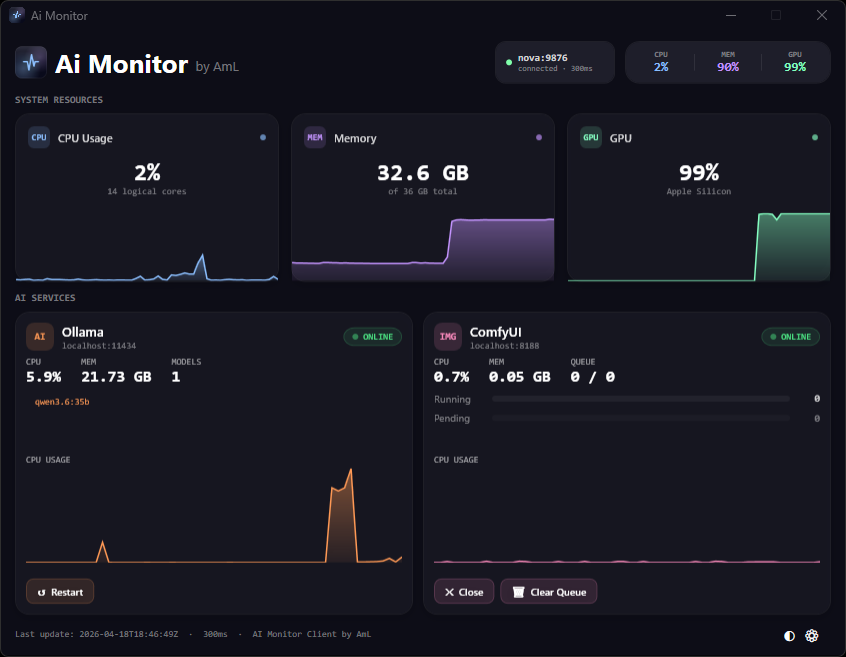
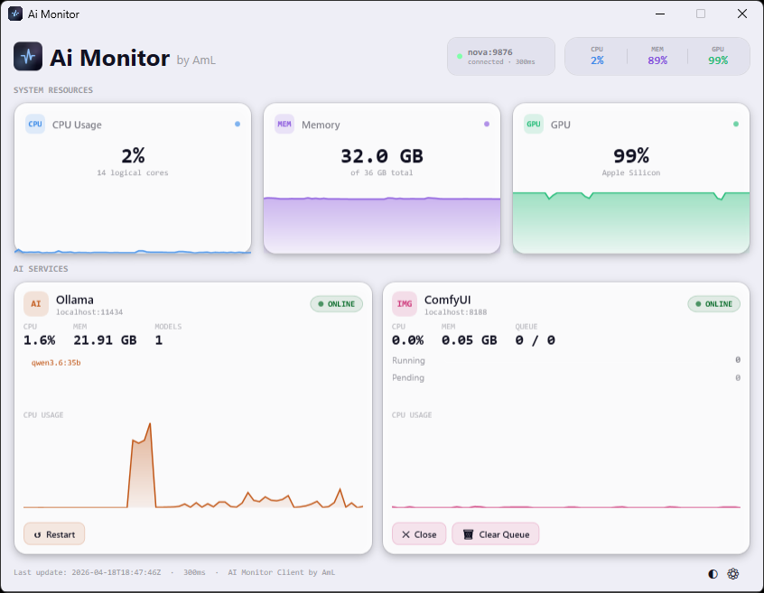

<p align="center">
  
</p>

<h1 align="center">Ai Monitor &nbsp;<sup><sub>by AmL</sub></sup></h1>

<p align="center">
  A real-time system and AI-services monitor for Apple Silicon Macs —<br>
  with a companion Windows client that connects remotely over your local network.
</p>

<p align="center">
  <a href="https://github.com/aml-one/aimonitor/raw/main/AiMonitor.dmg">
    
  </a>
  &nbsp;
  <a href="https://github.com/aml-one/aimonitor/raw/main/WindowsClient/publish/AiMonitorClient.exe">
    
  </a>
</p>

> **Windows client note:** Requires [.NET 10 Desktop Runtime](https://dotnet.microsoft.com/en-us/download/dotnet/10.0) to be installed on the Windows machine.

---

## Screenshots

<p align="center">
  <br>
  <em>macOS dashboard</em>
</p>

<p align="center">
  <br>
  <em>Windows client – dark theme</em>
</p>

<p align="center">
  <br>
  <em>Windows client – light theme</em>
</p>

---

## What It Does

**Ai Monitor** runs as a native menu-bar application on your Mac. It continuously tracks your system resources and the health of the AI tools you have running locally — specifically **Ollama** (for large language models) and **ComfyUI** (for image generation). All of this information is displayed in a compact, always-on-top dashboard window that updates every 300 ms.

Because AI workloads often benefit from being monitored from a separate machine (so the monitor itself doesn't consume the GPU you're trying to measure), Ai Monitor also exposes a lightweight **HTTP/JSON API** on port `9876`. The **Windows companion client** connects to this API over your local network and provides an identical, live view of what's happening on your Mac — without installing anything on the Mac side beyond the main app.

### What You Can Monitor

| Metric | Detail |
|---|---|
| **CPU** | Usage percentage, core count, rolling history graph |
| **Memory** | Used / total GB, usage history |
| **GPU** | Apple Silicon GPU usage percentage, history |
| **Ollama** | Online/offline status, CPU & RAM usage, loaded model list |
| **ComfyUI** | Online/offline status, CPU & RAM usage, running/pending queue depth |
| **This App** | Ai Monitor's own CPU and RAM footprint |

### Remote Actions (from both clients)

- Restart Ollama
- Close ComfyUI
- Clear the ComfyUI generation queue

---

## Architecture Overview

```
┌────────────────────────────────────────────────┐
│              Mac  (Host)                       │
│                                                │
│   ┌──────────────────────┐                     │
│   │   Ai Monitor (SwiftUI)│  ←  native UI      │
│   │   + HTTP API :9876   │  ←  JSON over LAN   │
│   └──────────┬───────────┘                     │
│              │  monitors locally               │
│   ┌──────────▼──────────────────────────────┐  │
│   │  Ollama  ·  ComfyUI  ·  System (CPU/GPU)│  │
│   └─────────────────────────────────────────┘  │
└────────────────────────────────────────────────┘
             ▲
             │  HTTP GET /stats  (same LAN)
             │
┌────────────┴───────────┐
│   Windows Client (WPF) │
│   read-only remote view│
└────────────────────────┘
```

The Mac app is the **single source of truth**. The Windows client is a **read-only remote viewer** — it polls the Mac's API and renders the same metrics in a native WPF window. No agent, no install, and no direct access to the Mac is required beyond network reachability.

---

## Mac Application

### Requirements

| Requirement | Version |
|---|---|
| macOS | 13 Ventura or later |
| Xcode | 15 or later |
| Swift | 5.9+ (bundled with Xcode) |
| Target hardware | Apple Silicon (M1 / M2 / M3 / M4 series) |

> The GPU monitoring relies on Apple Silicon's unified memory architecture. Intel Macs are not supported.

### Build Instructions

1. Clone or download this repository.
2. Open `AiMonitor.xcodeproj` in Xcode.
3. Select the **AiMonitor** scheme and your Mac as the run destination.
4. Press **⌘R** to build and run.

To create a distributable `.dmg`:

```bash
# From the repo root
xcodebuild -project AiMonitor.xcodeproj \
           -scheme AiMonitor \
           -configuration Release \
           -archivePath build/AiMonitor.xcarchive \
           archive

xcodebuild -exportArchive \
           -archivePath build/AiMonitor.xcarchive \
           -exportPath build/export \
           -exportOptionsPlist ExportOptions.plist
```

A pre-built `AiMonitor.dmg` is included in the repository root for convenience.

### First Launch

- The dashboard window opens automatically.
- The **API badge** in the top-right corner (`API · 9876`) turns blue when the local HTTP server is ready.
- Ollama and ComfyUI cards appear automatically if those applications are installed — no configuration needed.

---

## Windows Client

### Requirements

| Requirement | Version |
|---|---|
| Windows | 10 (build 1903+) or Windows 11 |
| .NET SDK | 10.0 |
| Visual Studio | 2022 (with **.NET desktop development** workload) |
| Architecture | x64, x86, or ARM64 |

> The Windows client is a WPF application targeting `net10.0-windows`. It does **not** require anything to be installed on the Mac beyond Ai Monitor itself.

### Build Instructions

1. Open `WindowsClient/AiMonitorClient.sln` in Visual Studio 2022.
2. Restore NuGet packages if prompted.
3. Set the build configuration to **Release** and target platform to **x64**.
4. Press **F5** to run, or **Ctrl+Shift+B** to build without launching.

To publish a self-contained executable:

```powershell
dotnet publish WindowsClient/AiMonitorClient.csproj `
    -c Release -r win-x64 --self-contained true `
    -p:PublishSingleFile=true `
    -o WindowsClient/publish
```

### Connecting to Your Mac

1. Make sure both your Mac and your Windows PC are on the **same local network** (Wi-Fi or Ethernet).
2. Launch Ai Monitor on the Mac and confirm the API badge is blue.
3. Find your Mac's local IP address: **System Settings → Network → Wi-Fi → IP Address** (e.g. `192.168.1.42`).
4. Launch the Windows client and open **Settings** (gear icon).
5. Enter your Mac's IP address and port `9876`, then save.

The dashboard will populate within one polling cycle.

### Settings

| Setting | Description |
|---|---|
| **Host** | Local IP address of the Mac running Ai Monitor |
| **Port** | API port (default: `9876`) |
| **Poll interval** | How often to refresh — 300 ms, 500 ms, 1 s, 2 s, or 5 s |
| **Theme** | Dark or Light |

---

## API Reference

The full API documentation is in [API.md](API.md).

**Quick summary:**

```
GET  http://<mac-ip>:9876/stats              → full system + services snapshot
GET  http://<mac-ip>:9876/system             → CPU, Memory, GPU only
GET  http://<mac-ip>:9876/services           → Ollama + ComfyUI only
POST http://<mac-ip>:9876/actions/ollama/restart
POST http://<mac-ip>:9876/actions/comfy/close
POST http://<mac-ip>:9876/actions/comfy/clear-queue
```

The API is plain HTTP/JSON with full CORS support, so it's also usable from scripts, browsers, or any other HTTP client on your network.

---

## Project Structure

```
aimonitor/
├── AiMonitor/               # macOS SwiftUI application
│   ├── Views/               # Dashboard, cards, components
│   ├── Monitors/            # SystemMonitor, ServiceMonitor
│   └── Networking/          # APIServer (NWListener, JSON serialisation)
├── WindowsClient/           # Windows WPF application (.NET 10)
│   ├── Controls/            # ServiceCard, MetricCard (UserControls)
│   ├── Models/              # ApiClient, AppSettings, data models
│   ├── Themes/              # Dark / Light resource dictionaries
│   └── *.xaml / *.xaml.cs   # Main window, Settings window
├── AiMonitor.xcodeproj      # Xcode project
├── AiMonitor.dmg            # Pre-built macOS distributable
├── API.md                   # Full API reference
└── README.md                # This file
```

---

## License

This project was built by **AmL** for personal use. Feel free to fork and adapt it for your own setup.
